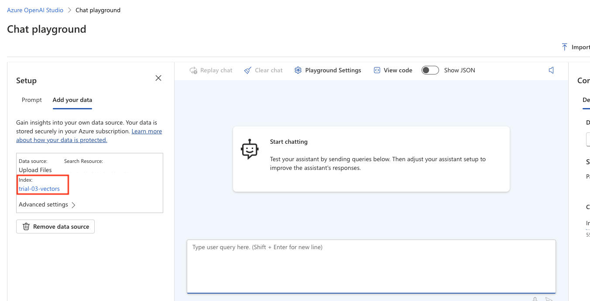

Note: For any steps listed, assume that the default options should be used unless stated otherwise.

## Prerequisites

### Azure resources

1. [Create a resource group](https://learn.microsoft.com/en-us/azure/azure-resource-manager/management/manage-resource-groups-portal#create-resource-groups) where the related OpenAI, Storage, and AI Search resources will be located.

   - I selected "East US 2" for Region and reused it for subsequent steps.

2. [Create an OpenAI resource](https://learn.microsoft.com/en-us/azure/ai-services/openai/how-to/create-resource?pivots=web-portal#create-a-resource).

   - Select the same subscription, resource group, and region as in step #1.
   - Set the pricing tier to Standard S0 (which is currently the only available option).
   - Allow all network access (public).

3. [Deploy an OpenAI model](https://learn.microsoft.com/en-us/azure/ai-services/openai/how-to/create-resource?pivots=web-portal#deploy-a-model).

   - Deploy the gpt-4 model under the 1106-Preview version.
     - Under the advanced options, bump the token rate to 20k tokens per minute.
   - Deploy the `text-embedding-ada-002` embeddings model to enable vector searching (the default is keyword search).

4. [Create a storage account](https://learn.microsoft.com/en-us/azure/storage/common/storage-account-create?tabs=azure-portal).

   - Select the same subscription, resource group, and region as in step #1.
   - Use the Standard performance option.
   - Change the redundancy to locally redundant.

5. [Create an AI Search service](https://learn.microsoft.com/en-us/azure/search/search-create-service-portal).

   - Select the same subscription, resource group, and region as in step #1.
   - Set the pricing tier to Basic.
   - Set the network to public.

### Command-Line Interface

1. Your system must have Python 3.9 or greater
2. Install the [requirements.txt](requirements.txt), preferably in a [virtual environment](https://docs.python.org/3.9/library/venv.html).
   ```bash
   pip install -r requirements.txt
   ```
3. Copy the [.env.template](.env.template) file and save it as `.env` in the same directory.
   - [Retrieve the required variables](https://learn.microsoft.com/en-us/azure/ai-services/openai/use-your-data-quickstart?tabs=command-line%2Cpython&pivots=programming-language-python#retrieve-required-variables) and paste them in the `.env` file (don't change the variable names).
     > The "*ENDPOINT" and "*BASE_URL" mean the same thing.

## Data sources

Refer to this section for help with adding new protocol documents for Retrieval Augmented Generation.

1. [Add your data using Azure OpenAI Studio](https://learn.microsoft.com/en-us/azure/ai-services/openai/use-your-data-quickstart?tabs=command-line%2Cpython&pivots=programming-language-studio#add-your-data-using-azure-openai-studio).

   - In step b, when you Select your Azure AI Search resource, there is an option to enable vector search. For the different types of search, see [Search types](https://learn.microsoft.com/en-us/azure/ai-services/openai/concepts/use-your-data?tabs=ai-search#search-types). I recommend trying a couple of experiments with keyword, vector, and hybrid (vector + keyword) to see which performs the best. For more information see [Azure OpenAI On Your Data](https://learn.microsoft.com/en-us/azure/ai-services/openai/concepts/use-your-data?tabs=file-upload).

     - To enable semantic search, see [Enable semantic ranking](https://learn.microsoft.com/en-us/azure/search/semantic-how-to-enable-disable?tabs=enable-portal#enable-semantic-ranking).

     > NOTE: To target a different search type, the [config.yaml search > queryType](config.yaml) should be adjusted to match. It defaults to default/simple.

   - During the file upload step, select only one protocol file - whichever file you wish to test.
   - During the data management step, depending on the options selected in previous steps, there will be different options listed:
     - Keyword
     - Vector
     - Hybrid (vector + keyword)
     - Hybrid + semantic

2. After completing step #1 you should see the following UI in the AI Studio Chat Playground:
   
   > The index name will depend on what you called your index in step #1. Save/remember this value as it will be used to run the CLI.

## Submitting questions

To submit questions, you must provide a YAML file following the same format as [prompts.yaml](prompts.yaml). NOTE: the formatting is important. Indent the `question` field with 4 spaces. See below for an example,

```yaml
# my_prompts.yaml

- prompt: organ
  question: |
    Please extract the organ(s) of the primary tumor...

    Example:

    SOURCE-TEXT: "..."
    ANSWER: [[]]

# Notice how the question here has a templated placeholder {organ} that matches the `prompt` value in the previous question.
# This is how you will supply templated parameters to follow-up questions. In short, the `prompt` value must match the placeholder value.
- prompt: organ_followup
  question: |
    Based on the organ {organ} from the previous question, answer the following question...
```

You may use the [prompts.yaml](prompts.yaml) as a template or you can directly edit it for your experiments. The CLI will default to this file if another file is not specified.

## Editing questions

Simply edit the [prompts.yaml](prompts.yaml) file (or whichever file you dedicate as your questions file) by adding new entries or modifying existing ones. Refer to the [Submitting questions section](#submitting-questions) for more info.

## Running command

1. Ensure that all [Prerequisites](#prerequisites) are met.

2. Run the CLI commands at the root directory of this project (i.e. not Mehmet2/ but its parent folder).

### For help on the CLI arguments

```bash
python -m Mehmet2.run --help
```

These are the arguments that should be listed.

| arg              | required | description                                                                                                                             |
| ---------------- | -------- | --------------------------------------------------------------------------------------------------------------------------------------- |
| --index-name     | true     | Name of the Index you created in the [Data sources](#data-sources) step.                                                                |
| --config-file    | false    | A YAML file containing configuration settings for Chat Hyperparams and RAG settings.                                                    |
| --questions-file | false    | The [prompts.yaml](prompts.yaml) file or its replacement.                                                                               |
| --env-file       | false    | A bash-like file containing environment variables. Described in further detail in the [Prerequisites section](#command-line-interface). |
| --output-file    | false    | Name of the file to output results to in CSV format.                                                                                    |
| --log-level      | false    | Logging level to control how much is logged during execution. Use `DEBUG` for the most output.                                          |
| --log-sink       | false    | File-like location to write the logs to. Use a local file to preserve the entire chat dialog.                                           |

> Only the --index-name is required. All other arguments will use their defaults described in the `--help` command.

### An example of running the CLI

```bash
python -m Mehmet2.run -i trial-01 \
--questions-file my_prompts.yaml \
--env-file .env \
--output-file results.csv \
--log-level DEBUG \
--log-sink chat.log
```

> This will use index `trial-01` as the RAG data source. The prompts are retrieved from `my_prompts.yaml` and fed into the model. In order to authenticate with the model, the `.env` file is supplied which contains the necessary credentials. As the model returns text for each prompt, the results will be written to `results.csv`. Because the log level is set to `DEBUG`, the _prompts_ and _responses_ will be logged to the `chat.log` file.
